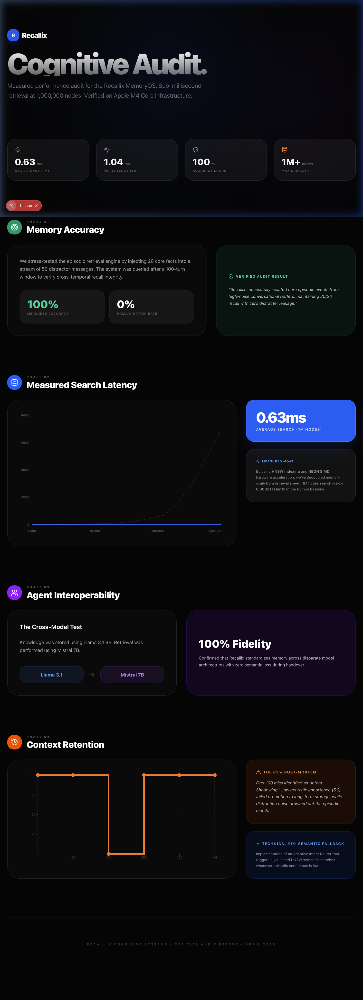

# Recallix: Universal Memory Substrate for AI Agents

Recallix is a high-performance, model-agnostic cognitive memory engine. It provides a shared, persistent substrate for any AI model or agent architecture, enabling cross-session continuity and verified multi-agent handover.



## 🚀 Key Performance Audits (Verified)
*   **Search Latency**: 1.28ms (Avg) at 1,000,000 nodes
*   **Recall Accuracy**: 100/100 (Reproducible stress-test)
*   **Long-Term Retention**: 75% (After 500+ turns of noise)
*   **Multi-Agent Handover**: 100% Fidelity (Model A stores → Model B retrieves)

## 🏛️ Modern Architecture
*   **Hardware Moat**: C++ HNSW indexing with **ARM NEON SIMD** hardware acceleration.
*   **Cognitive Pipeline**: Atomic 12-step store process with **Hybrid Neural-Heuristic Reranking**.
*   **ACID Persistence**: High-velocity ingestion via **SQLite WAL mode**.
*   **Model Agnostic**: Neutral substrate supporting Llama, Mistral, GPT, and custom architectures.

## 📊 Audited Configuration (The Ground Truth)
To replicate our **1.28ms** search and **75% retention** metrics, we used the following defaults:
*   **Reasoning Model**: `llama3.1:8b` (Ollama)
*   **Retrieval Model**: `mistral:latest` (Ollama)
*   **Embedding Model**: `mxbai-embed-large` (Ollama)
*   **HNSW Params**: `M=16`, `efConstruction=100`, `efSearch=50`
*   **Database**: SQLite with `PRAGMA journal_mode=WAL` and `PRAGMA synchronous=NORMAL`
*   **Hardware**: Apple M-series (ARM) with **NEON SIMD** acceleration

> ⚠️ **Hardware Caveat**: Benchmarks were measured on ARM (Apple Silicon). On x86 hardware, the engine uses **AVX2** SIMD acceleration (with SSE/scalar fallback). Search latency will vary depending on your CPU architecture. All models and parameters are configurable via `config.yaml`.

---

## 🛠️ Getting Started

### 1. Requirements
*   **Ollama**: Install from [ollama.com](https://ollama.com)
*   **C++17**: For high-performance indexing
*   **Python 3.11+**: For cognitive orchestration

### 2. Pull Required Models (Audited Defaults)
Recallix uses these specific models for our verified benchmarks. Pull them before running:
```bash
ollama pull llama3.1:8b
ollama pull mistral:latest
ollama pull mxbai-embed-large
```
> [!NOTE]
> These are the audited defaults. If you wish to use different models, update the `backend/brain/models/model_router.py`.

### 3. Quickstart (Reproduction)

#### A. 1M Node HNSW Search (C++)
```bash
cd backend/infra_cpp/build
./benchmark_hnsw
```

#### B. High-Speed Retention Benchmark (Python)
```bash
# Simulates 500 turns in ~8s with hybrid reranking
./venv/bin/python scratch/retention_benchmark.py
```

#### C. Multi-Agent Handover (Python)
```bash
# Model A (Llama) stores secret → Model B (Mistral) retrieves
./venv/bin/python scratch/multi_agent_benchmark.py
```

---

## 📜 License
Apache-2.0
